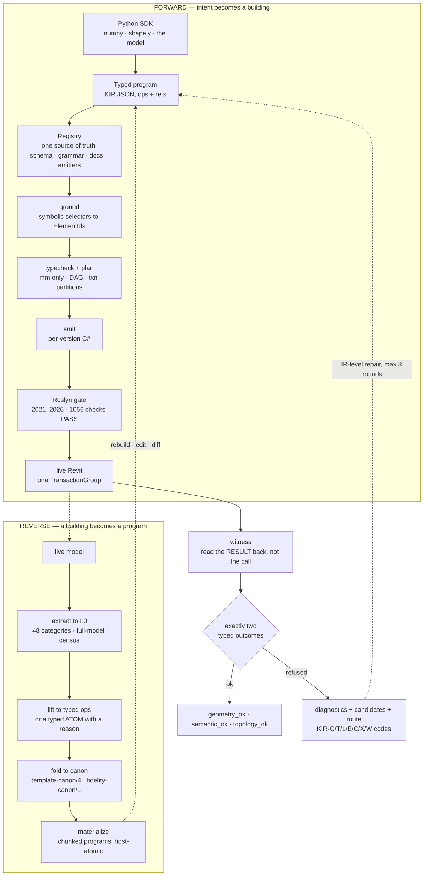
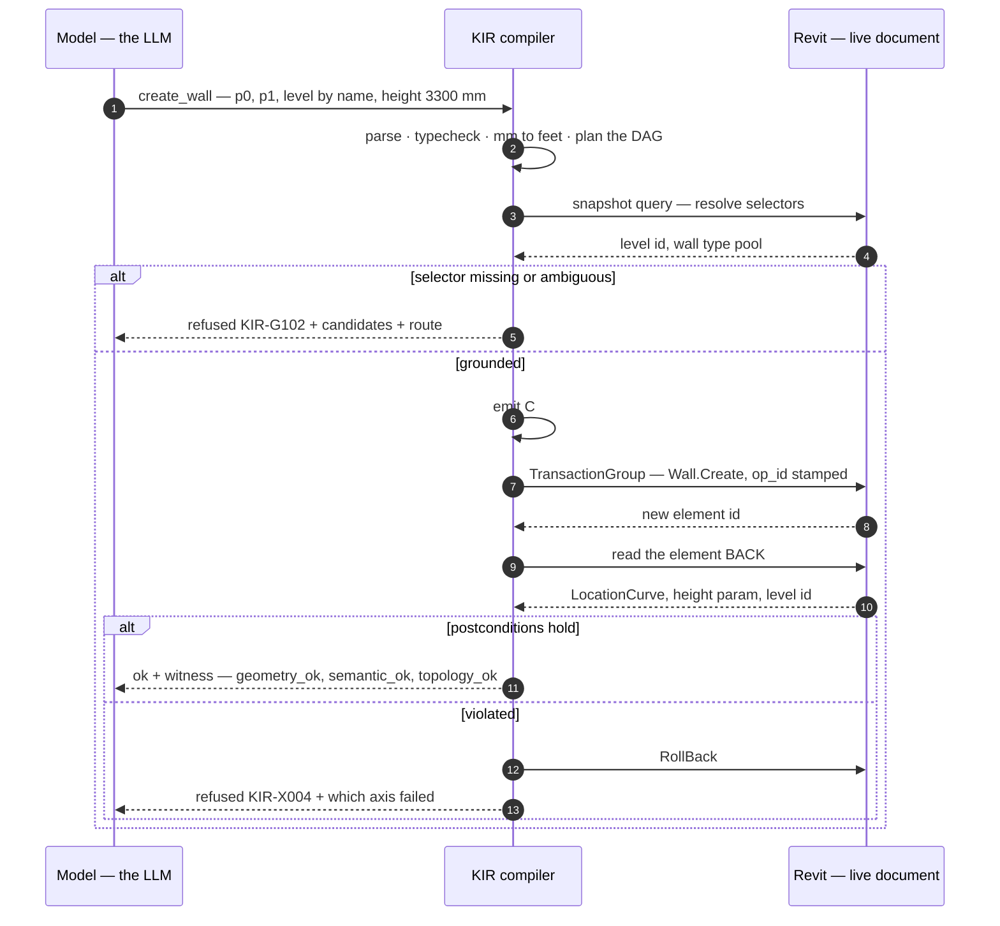
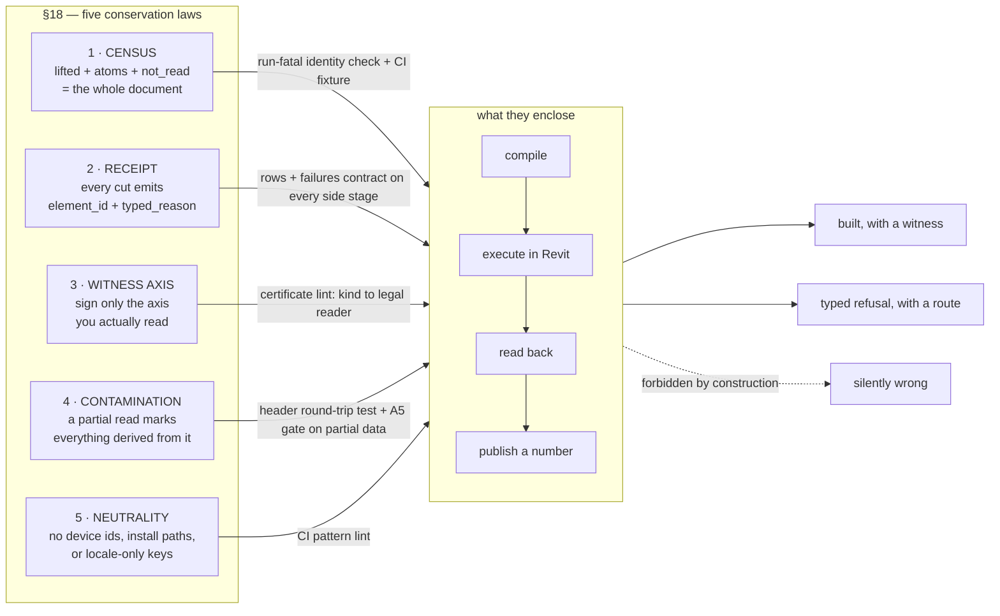

🇷🇺 [Русская версия](README.ru.md)

<p align="center">
  
</p>

<h1 align="center">KIR</h1>

<p align="center">
  <b>A building is a program.</b><br/>
  Typed, verifiable IR for Autodesk Revit — Python brains, verified hands.
</p>

<p align="center">
  
  
  
  
  
</p>

<p align="center">
  <a href="#why">Why</a> ·
  <a href="#the-idea-in-one-picture">The idea</a> ·
  <a href="#show-me-code">Code</a> ·
  <a href="#measured-not-promised">Measured facts</a> ·
  <a href="#the-five-laws">Five laws</a> ·
  <a href="docs/ARCHITECTURE.md">Architecture</a> ·
  <a href="examples/README.md">Examples</a> ·
  <a href="#constellation">Constellation</a>
</p>

---


<p align="center">
  
</p>

The same building, held two ways. As the verified C# that KIR emits for a single Revit version,
the 60-storey tower from [`examples/tower_numpy.py`](examples/tower_numpy.py) weighs
**3 616 130 characters — roughly 0.9M tokens, beyond any model's context window**. As the typed
KIR program a model actually edits, it weighs **15 508 characters — roughly 4k tokens, 233×
less**. That is the difference between a model that can re-plan a floor or bend a facade with
every change verified, and a model that cannot even read the building it is asked to change.
*(Sizes measured 2026-07-28 by running the example in this repo; the render is a visual
companion, not the measurement.)*

## Why

Language models write code well. They do not write buildings well, and the reason is structural
rather than a matter of training scale. A building does not fit in a context window — one of the
models we measure against holds **90 758 elements**. The work is stateful: a wall must exist before
a door can be hosted in it, and that state lives inside an application, not in a file you can diff.
It is re-entrant, because the same instruction issued twice must not produce two doors. And it is
versioned six ways: the same intent compiles differently against Revit 2021 and Revit 2026.

So the practice today is to have the model write Revit C# directly, and the arithmetic of that
practice is available to us. Across **85 374 production compile errors** logged over seven weeks,
two codes account for **48.4%** — `CS1061` (32.3%) and `CS0117` (16.1%) — and both are the same
failure: *a member of the Revit API that does not exist*. Another ~10% (`CS0104`/`CS0012`) are
namespace and assembly-reference problems. Roughly **60% of all production compile errors are spent
fighting the surface of an API**, not describing a building.

**KIR is an attempt to build it**: the model concentrates on
3D, geometry and composition; units, transactions, API versions, hosts, witnesses and rollbacks
belong to a compiler.

## The idea in one picture



Two properties matter more than the boxes.

**Every call ends in exactly one of two typed outcomes** — an `ok` carrying a read-back proof, or a
machine-readable `refused` with candidates and a route to a fallback path. A silently-wrong answer
is the single forbidden state; `ok:true` wrapping a nested error is a permanent regression case with
its own test.

**The IR runs in both directions.** Anything the lifter cannot express becomes a *typed atom with a
reason code*, never a silent drop. That reverse direction is what turns "we can build" into "we can
edit what already exists".

A stage-by-stage account of both pipelines — the registry as one source of truth, isolation modes,
the census, fold, rebuild verification — lives in [**docs/ARCHITECTURE.md**](docs/ARCHITECTURE.md).

## Show me code

A real program, printed verbatim from the SDK:

```json
{
  "ir_version": "1.0",
  "intent": "one bay: wall + door + window",
  "ops": [
    {"op": "create_wall", "id": "wall1",
     "p0_mm": [0, 0], "p1_mm": [6000, 0],
     "level": {"by": "name", "value": "Level 1"}, "height_mm": 3300},
    {"op": "create_door", "id": "door1",
     "host": {"by": "ref", "value": "wall1"},
     "offset_mm": 1200, "sill_mm": -100,
     "symbol": {"by": "name", "value": "0915 x 2134mm"},
     "mirrored": false, "hand_flipped": false, "facing_flipped": false}
  ]
}
```

Note what is *not* expressible. A door has no `xyz`: it is `host` + `offset_mm` along the host +
`sill_mm`. "A window floating in the air" is not a case we validate — it is a sentence the language
cannot form. Every length is millimetres; feet do not exist in the IR.

The Python surface is generated, not written: **35 builders are born from the registry at import
time, one per registry op** (2026-07-28), so a signature cannot drift from the spec. The SDK adds no semantics of its own — it cannot
express anything the registry lacks, and it cannot hide a refusal.

```python
import numpy as np
from kukai.ir import sdk

p = sdk.program(intent="tower with a waist")
with p.stack(levels=20, h_mm=3600,
             transform=sdk.transform(scale_xy_top=[0.8, 0.8],
                                     twist_deg_total=24)) as floor:
    for a in np.linspace(0, 2 * np.pi, 12, endpoint=False):
        floor.add(sdk.create_column(xy=[20000 * np.cos(a), 20000 * np.sin(a)],
                                    level=sdk.BY_MACRO, symbol="К 300x300"))

p.stats()   # {'ops_written': 1, 'ops_expanded': 260, 'elements': 240}
out = p.compile(version="2023", snapshot=snap)
```

The shipped example goes further. In `tower_numpy.py`, numpy computes a sinusoidal waist and twist
and KIR repeats the storey — run on 2026-07-28:

```text
100 lines of Python -> 6 authored ops -> 840 after expansion -> 780 elements (3 KIR programs)
60 storeys, 30% waist, 120 deg total twist
piecewise vs. true sine: 217 mm along the radius
compilation: 6/6 versions ['2021','2022','2023','2024','2025','2026']
```

That third line is the point. `stack.transform` interpolates linearly; the requested curve is a
sine. Saying "sine" and building a polyline **without naming the divergence** would be a silently
wrong answer, so the example prints the error in millimetres.

Both demonstrations — the numpy tower and a shapely-cut curved floor plate — ship in
[**examples/**](examples/README.md) with their measured outputs.

### What happens to one op



That stamp is why a retry is idempotent: op ids are written into the model inside the same
transaction, so re-running a program skips what is already stamped, and resume-from-op-K is simply
"skip what carries a stamp".

## Measured, not promised

Everything below is derived from an instrument on the date shown, not from memory.

| Fact | Value | Date / source |
|---|---|---|
| Writing ops in the registry | **31** (+4 query) | 2026-07-28, `spec.OPS` |
| Writing ops with at least one successful live run + witness | **31 of 31** | union of `data/telemetry/kir_witness.jsonl` (rows with `ok` + `family=write` + `duration_ms>0`; includes the 2026-07-28 runs P8/P10v2/P11 and the night P9) and the 2026-07-27 live-matrix artifact (adds `create_floor`, `create_room`) |
| Last op to close | `move_elements` — 2026-07-28 night, Revit 2026: a *connected* cable-tray pair moved +500 mm Z, witness 3/3, connection verified alive by an independent read | same |
| Six-version compile gate | **1 056 Roslyn compilations, PASS** (101 atomic + 69 per-op × 6 versions) | 2026-07-28 |
| Test suite | **1 692 passed / 2 767 subtests** | 2026-07-28, full suite in a clean window |
| Categories the reverse direction reads | **48** | 2026-07-28 |
| Coverage — R2023 model, 1 383 elements | **93.28%** (raw 77.30%) | 2026-07-27 |
| Coverage — R2026 model, 90 758 elements | **92.83%** (raw 56.94%) | 2026-07-27 |
| Production compile errors structurally inexpressible in KIR | **≈60%** of 85 374 over seven weeks | with the source report's caveats on log completeness |

## The five laws

The invariant is easy to write and hard to keep: **zero silently-wrong outcomes**. On 2026-07-28 an
audit found that our own spec stated it in prose — and the implementation had drifted exactly where
the prose did not compile. So honesty became arithmetic: five conservation laws, each with an
enforcement mechanism. Breaking one is a build or run failure, not a note to a reviewer.



Full account: [**Five Conservation Laws of Honesty for an AI Agent in CAD**](docs/articles/2026-07-five-laws-of-honesty.md).

## Read more

- [**A Building Is a Program**](docs/articles/2026-07-a-building-is-a-program.md) — the long-form
  technical case: what the IR expresses, why it runs in both directions, and the measured number
  behind each claim.
- [**Five Conservation Laws of Honesty for an AI Agent in CAD**](docs/articles/2026-07-five-laws-of-honesty.md)
  — the five laws, the catch behind each, and how each one is mechanically enforced.
- [**A Day of Measured Revit API Traps**](docs/articles/2026-07-revit-api-traps.md) — fourteen Revit
  API behaviours as symptom, wrong hypothesis, measurement, rule. Useful even if you never touch KIR.
- [**One Day Inside an AI-led Compiler Team**](docs/articles/2026-07-one-day-chronicle.md) — a
  first-person account of one working day on this project.

## Constellation

Two of the articles above now live in their own repositories, developed and versioned
independently rather than as sections of this one:

- [**revit-api-traps**](https://github.com/BigDick2014/revit-api-traps) — a living catalog of
  measured Autodesk Revit API traps. Each entry: documented | observed | our bug.
- [**five-laws-of-honesty**](https://github.com/BigDick2014/five-laws-of-honesty) — the five
  conservation laws, standalone.

The numbers manifest for the whole constellation stays here:
[`docs/articles/publication_manifest.json`](docs/articles/publication_manifest.json).

## Roadmap to August 9

The date is a commitment, not a result already achieved. What ships is the compiler core: the
registry, the schema and grammar generators, the staged pipeline, the per-version emitters, the
witness machinery, the decompile spine, and the specs that govern them.

| Milestone | State |
|---|---|
| Specs canonised inside the repository (`SPEC_V1.md`, `KIR_DECOMPILE_SPEC.md`) | done 2026-07-28 |
| Delivery neutrality — device allow-list, no absolute paths, no locale-only keys | done 2026-07-28 |
| Every module signed `live` / `incubating` / `deleted` in `WIRING.md` | done 2026-07-28 |
| Translation certificate wired into the compile gate | planned |
| `open_model` preflight — one live RollBack run, then default-on | planned |
| Mission bench, full run on a held-out corpus | planned |
| Incremental-rebuild spine wired (merkle first — it is the keystone) | planned, after the bench |
| Code lands in this repository | **August 9, 2026** |

---

<p align="center">
  <sub>Apache License 2.0 — see <a href="LICENSE">LICENSE</a>.</sub>
</p>
