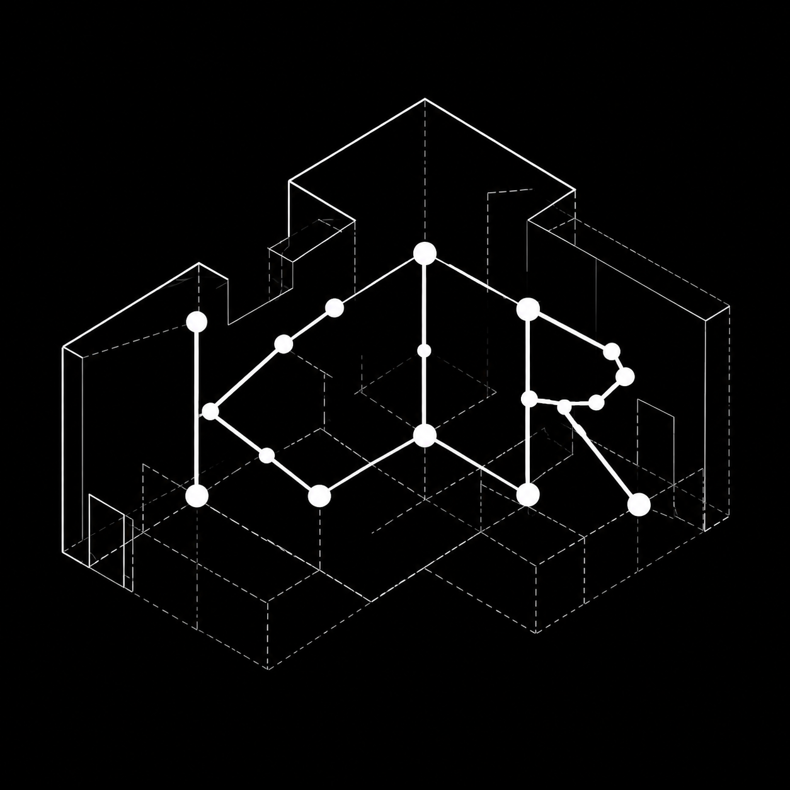
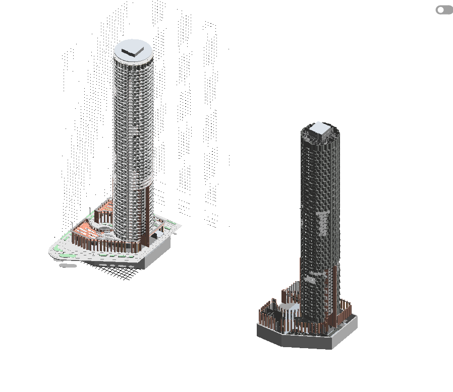
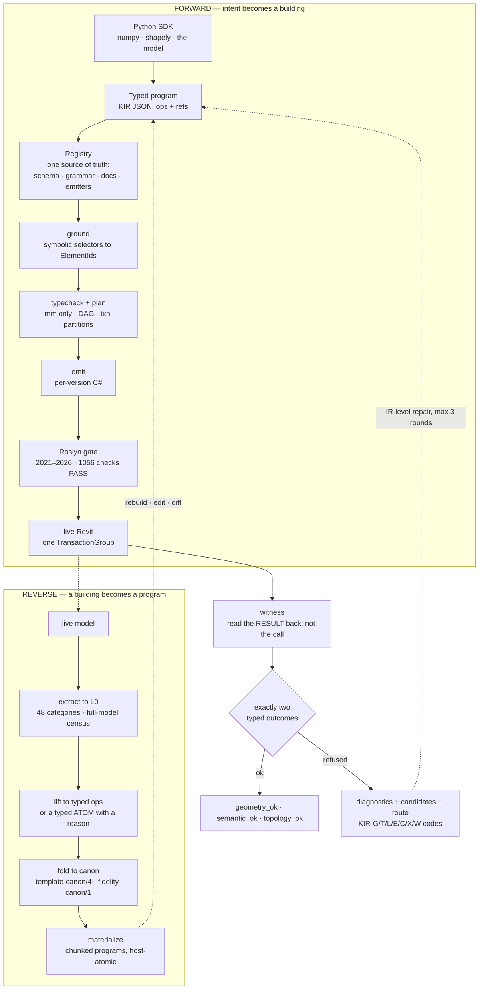
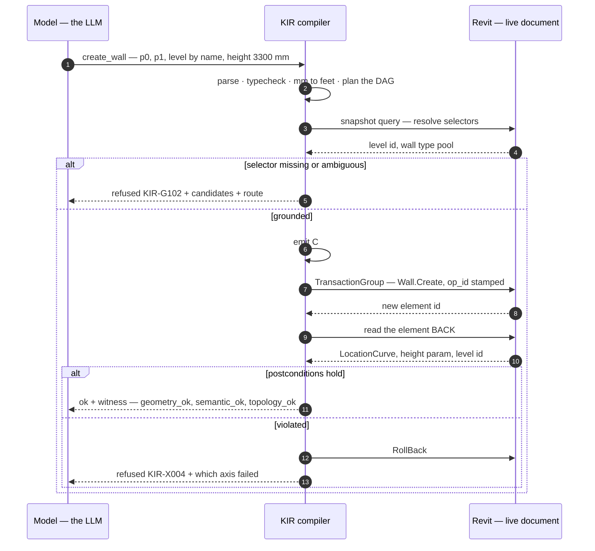
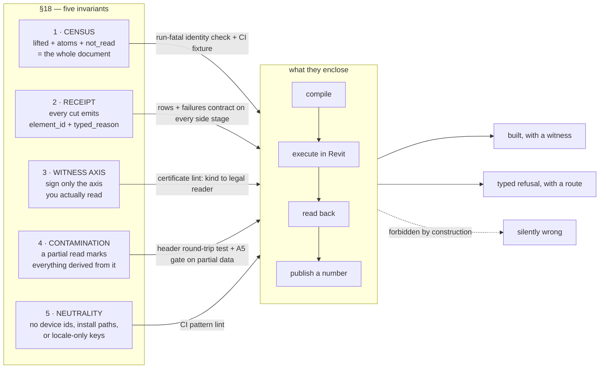

<p align="center">
  
</p>

<h1 align="center">KIR</h1>

<p align="center">
  <b>A building is a program.</b><br/>
  Typed, verifiable IR for Autodesk Revit — Python brains, verified hands.
</p>

<p align="center">
  
  
  
  
  
</p>

<p align="center">
  <a href="#why">Why</a> ·
  <a href="#the-idea-in-one-picture">The idea</a> ·
  <a href="#show-me-code">Code</a> ·
  <a href="#measured-not-promised">Measured results</a> ·
  <a href="#the-five-laws">Invariants</a> ·
  <a href="examples/README.md">Examples</a> ·
  <a href="#repository-state">Repository state</a>
</p>

---


<p align="center">
  
</p>

The same building, held two ways. As the verified C# that KIR emits for a single Revit version,
the 60-storey tower from [`examples/tower_numpy.py`](examples/tower_numpy.py) weighs
**3 616 130 characters — roughly 0.9M tokens, beyond any model's context window**. As the typed
KIR program a model actually edits, it weighs **15 508 characters — roughly 4k tokens, 233×
less**. That is the difference between a model that can re-plan a floor or bend a facade with
every change verified, and a model that cannot even read the building it is asked to change.
*(Sizes measured 2026-07-28 by running the example in this repo; the render is a visual
companion, not the measurement.)*

## Why

Language models write code well. They do not write buildings well, and the reason is structural
rather than a matter of training scale. A building does not fit in a context window — one of the
models we measure against holds **90 758 elements**. The work is stateful: a wall must exist before
a door can be hosted in it, and that state lives inside an application, not in a file you can diff.
It is re-entrant, because the same instruction issued twice must not produce two doors. And it is
versioned six ways: the same intent compiles differently against Revit 2021 and Revit 2026.

So the practice today is to have the model write Revit C# directly, and the arithmetic of that
practice is available to us. Across **85 374 production compile errors** logged over seven weeks,
two codes account for **48.4%** — `CS1061` (32.3%) and `CS0117` (16.1%) — and both are the same
failure: *a member of the Revit API that does not exist*. Another ~10% (`CS0104`/`CS0012`) are
namespace and assembly-reference problems. Roughly **60% of all production compile errors are spent
fighting the surface of an API**, not describing a building.

**KIR is an attempt to build it**: the model concentrates on
3D, geometry and composition; units, transactions, API versions, hosts, witnesses and rollbacks
belong to a compiler.

## The idea in one picture



Two properties matter more than the boxes.

**Every call ends in exactly one of two typed outcomes** — an `ok` carrying a read-back proof, or a
machine-readable `refused` with candidates and a route to a fallback path. A silently-wrong answer
is the single forbidden state; `ok:true` wrapping a nested error is a permanent regression case with
its own test.

**The IR runs in both directions.** Anything the lifter cannot express becomes a *typed atom with a
reason code*, never a silent drop. That reverse direction is what turns "we can build" into "we can
edit what already exists".

A stage-by-stage account of both pipelines — the registry as one source of truth, isolation modes,
the census, fold, rebuild verification — lives in **docs/ARCHITECTURE.md**.

## Repository layout

The current repository contains the runnable source snapshot, not only the public open-core slice:

- `backend/kukai/ir/` — the forward compiler, typed diagnostics, serving, witness/acceptance
  machinery and the reverse/decompile pipeline;
- `backend/kukai/modeling/bridge/` — bridge clients and adapters used to talk to a Revit session;
- `backend/compile-service/` — the .NET 8 Roslyn service used for versioned C# compilation;
- `backend/kukai/ir/tests/` and `backend/tests/` — unit, contract and bridge tests;
- `examples/` — small SDK programs that can be compiled offline before connecting Revit.

Runtime data, credentials, virtual environments, build outputs and logs are intentionally not part
of the repository. A live run still requires a separately installed Revit bridge and the matching
Revit API reference packages.

## Show me code

A real program, printed verbatim from the SDK:

```json
{
  "ir_version": "1.0",
  "intent": "one bay: wall + door + window",
  "ops": [
    {"op": "create_wall", "id": "wall1",
     "p0_mm": [0, 0], "p1_mm": [6000, 0],
     "level": {"by": "name", "value": "Level 1"}, "height_mm": 3300},
    {"op": "create_door", "id": "door1",
     "host": {"by": "ref", "value": "wall1"},
     "offset_mm": 1200, "sill_mm": -100,
     "symbol": {"by": "name", "value": "0915 x 2134mm"},
     "mirrored": false, "hand_flipped": false, "facing_flipped": false}
  ]
}
```

Note what is *not* expressible. A door has no `xyz`: it is `host` + `offset_mm` along the host +
`sill_mm`. "A window floating in the air" is not a case we validate — it is a sentence the language
cannot form. Every length is millimetres; feet do not exist in the IR.

The Python surface is generated, not written: **35 builders are born from the registry at import
time, one per registry op** (2026-07-28), so a signature cannot drift from the spec. The SDK adds no semantics of its own — it cannot
express anything the registry lacks, and it cannot hide a refusal.

```python
import numpy as np
from kukai.ir import sdk

p = sdk.program(intent="tower with a waist")
with p.stack(levels=20, h_mm=3600,
             transform=sdk.transform(scale_xy_top=[0.8, 0.8],
                                     twist_deg_total=24)) as floor:
    for a in np.linspace(0, 2 * np.pi, 12, endpoint=False):
        floor.add(sdk.create_column(xy=[20000 * np.cos(a), 20000 * np.sin(a)],
                                    level=sdk.BY_MACRO, symbol="К 300x300"))

p.stats()   # {'ops_written': 1, 'ops_expanded': 260, 'elements': 240}
out = p.compile(version="2023", snapshot=snap)
```

The shipped example goes further. In `tower_numpy.py`, numpy computes a sinusoidal waist and twist
and KIR repeats the storey — run on 2026-07-28:

```text
100 lines of Python -> 6 authored ops -> 840 after expansion -> 780 elements (3 KIR programs)
60 storeys, 30% waist, 120 deg total twist
piecewise vs. true sine: 217 mm along the radius
compilation: 6/6 versions ['2021','2022','2023','2024','2025','2026']
```

That third line is the point. `stack.transform` interpolates linearly; the requested curve is a
sine. Saying "sine" and building a polyline **without naming the divergence** would be a silently
wrong answer, so the example prints the error in millimetres.

Both demonstrations — the numpy tower and a shapely-cut curved floor plate — ship in
[**examples/**](examples/README.md) with their measured outputs.

### What happens to one op



That stamp is why a retry is idempotent: op ids are written into the model inside the same
transaction, so re-running a program skips what is already stamped, and resume-from-op-K is simply
"skip what carries a stamp".

## Measured results

Everything below is derived from an instrument on the date shown, not from memory.

| Fact | Value | Date / source |
|---|---|---|
| Writing ops in the registry | **35** (+4 query) | current `backend/kukai/ir/spec.py` |
| Published backend snapshot | **801 code/config files** | current `main`, 2026-08-03 |
| Python syntax check at publication | **768 files parsed** | Python 3.12, 2026-08-03 |
| Offline KIR smoke compile | **PASS** — level program emitted Revit 2023 C# | Python 3.12, 2026-08-03 |
| Historical live baseline | **31 of 31 writing ops** had a witnessed run | 2026-07-28 local telemetry; telemetry is not shipped here |
| Historical six-version compile gate | **1 056 Roslyn compilations, PASS** | 2026-07-28 local gate run |
| Historical reverse-direction coverage | **48 categories; 92.83% on the 90 758-element R2026 model** | 2026-07-27/28 local runs |
| Historical production compile errors structurally inexpressible in KIR | **≈60%** of 85 374 over seven weeks | local report; completeness caveats apply |

## Checked invariants

The reverse pipeline enforces five checked invariants: full document coverage, a reason recorded for
every element it cannot express, witnesses that match the data actually read, contamination marking
for partial reads, and neutral identifiers. Each invariant is backed by a test or verification run;
a violation stops the build or run.



Full account: **Five Conservation Laws of Honesty for an AI Agent in CAD**.

## Read more

- **A Building Is a Program** — the long-form
  technical case: what the IR expresses, why it runs in both directions, and the measured number
  behind each claim.
- **Five Conservation Laws of Honesty for an AI Agent in CAD**
  — the five laws, the catch behind each, and how each one is mechanically enforced.
- **A Day of Measured Revit API Traps** — fourteen Revit
  API behaviours as symptom, wrong hypothesis, measurement, rule. Useful even if you never touch KIR.
- **One Day Inside an AI-led Compiler Team** — a
  first-person account of one working day on this project.

<a id="repository-state"></a>
## Current repository state

The KIR backend source is published in `main` now. To prepare a clean local environment:

```bash
cd backend
python3.12 -m venv .venv
. .venv/bin/activate
pip install -r requirements.txt
PYTHONPATH=. python -c "from kukai.ir import spec; print(len(spec.OPS))"
dotnet restore compile-service/CompileService.csproj
dotnet run --project compile-service
```

The last two commands provision and start the Roslyn compile service. Live execution additionally
needs a Revit 2021–2026 installation, its API reference assemblies and a separately running bridge.
The source snapshot is deliberately free of machine-specific paths, credentials and runtime data.

---

<p align="center">
  <sub>Apache License 2.0 — see <a href="LICENSE">LICENSE</a>.</sub>
</p>

## For auditors

Beyond the compiler core (`backend/kukai/ir/`, `compile-service/`):

- **Language contracts:** `backend/kukai/ir/specs/` (`SPEC_V1.md`, decompile spec)
- **Laws of honesty / cert / merkle:** `docs/laws/`
- **NN authoring skill + sandbox course:** `backend/kukai/ir/skill.py`, `backend/kukai/ir/course/`
- **CI evidence & secret boundary:** `.github/workflows/kir-evidence.yml`, `kir-security.yml`
- **Audit / matrix tools:** `backend/tools/{bounds_audit,api_trap_audit}.py`, `backend/scripts/*matrix*`
