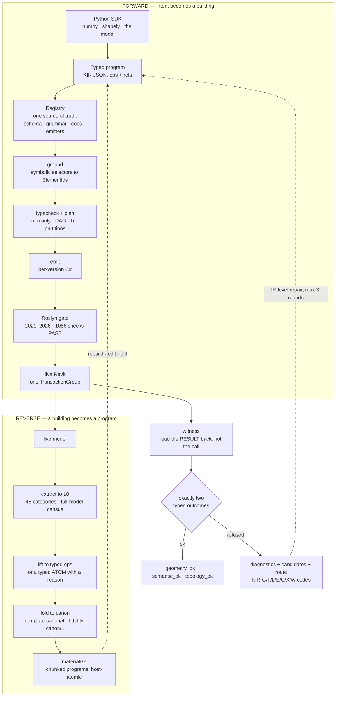
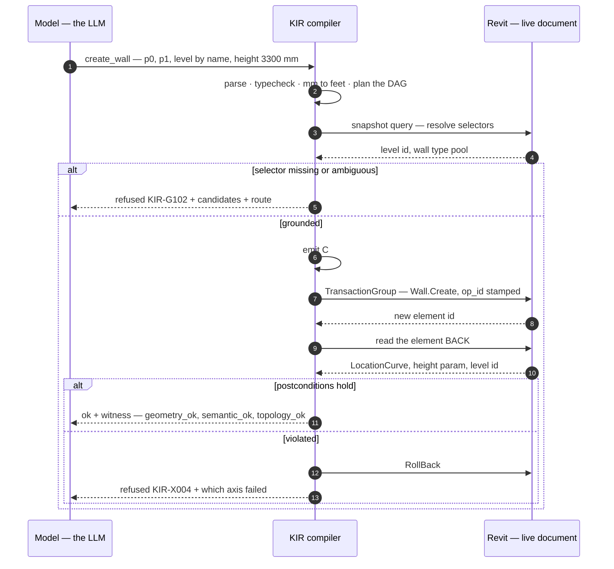
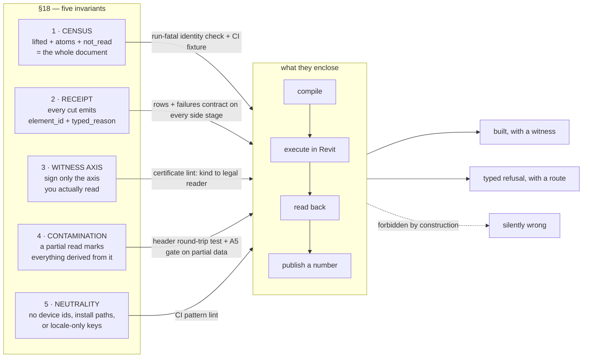

🇬🇧 [English version](README.md)

<p align="center">
  
</p>

<h1 align="center">KIR</h1>

<p align="center">
  <b>Здание — это программа.</b><br/>
  Типизированное, верифицируемое IR для Autodesk Revit — мозги на Python, проверенные руки.
</p>

<p align="center">
  
  
  
  
  
</p>

<p align="center">
  <a href="#why">Зачем</a> ·
  <a href="#the-idea-in-one-picture">Идея одной картинкой</a> ·
  <a href="#show-me-code">Код</a> ·
  <a href="#measured-not-promised">Фактические результаты</a> ·
  <a href="#the-five-laws">Инварианты</a> ·
  <a href="docs/ARCHITECTURE.ru.md">Архитектура</a> ·
  <a href="examples/README.ru.md">Примеры</a> ·
  <a href="#repository-state">Состояние репозитория</a>
</p>

---


<p align="center">
  
</p>

Одно и то же здание, удержанное двумя способами. Как проверенный C#, который KIR эмитирует для
одной версии Revit, 60-этажная башня из [`examples/tower_numpy.py`](examples/tower_numpy.py)
весит **3 616 130 символов — порядка 0.9 млн токенов, это не влезает ни в один контекст**. Как
типизированная KIR-программа, которую модель и правит, — **15 508 символов, порядка 4 тыс.
токенов: в 233 раза меньше**. Это разница между моделью, которая может перекроить планировку
или изогнуть фасад — и каждое изменение будет проверено, — и моделью, которая не способна даже
прочитать здание, которое её просят изменить. *(Размеры замерены 2026-07-28 запуском примера из
этого репо; рендер — визуальное сопровождение, не сам замер.)*

<a id="why"></a>
## Зачем

Языковые модели хорошо пишут код. Здания они пишут плохо, и причина здесь структурная, а не
вопрос масштаба обучения. Здание не помещается в контекстное окно — одна из моделей, на которых мы
сверяемся, держит **90 758 элементов**. Работа стейтфул: стена должна существовать раньше, чем в ней
можно разместить дверь, а это состояние живёт внутри приложения, а не в файле, который можно
сравнить diff'ом. Она реентерабельна: одна и та же инструкция, поданная дважды, не должна породить
две двери. И она версионирована на шесть ладов: один и тот же замысел компилируется по-разному для
Revit 2021 и Revit 2026.

Поэтому сегодняшняя практика — заставить модель писать Revit C# напрямую, и арифметика этой
практики у нас перед глазами. Из **85 374 боевых ошибок компиляции**, залогированных за семь недель,
два кода дают **48.4%** — `CS1061` (32.3%) и `CS0117` (16.1%) — и оба это один и тот же отказ:
*обращение к члену Revit API, которого не существует*. Ещё ~10% (`CS0104`/`CS0012`) — проблемы с
namespace и ссылками на сборки. Грубо говоря, **около 60% всех боевых ошибок компиляции тратятся на
борьбу с поверхностью API**, а не на описание здания.

**KIR — попытка его построить**: модель концентрируется на 3D,
геометрии и композиции, а единицы измерения, транзакции, версии API, хосты, свидетели и откаты
отдаются компилятору.

<a id="the-idea-in-one-picture"></a>
## Идея одной картинкой



Важнее самих блоков — два свойства.

**Каждый вызов заканчивается ровно одним из двух типизированных исходов** — либо `ok` с
доказательством, полученным обратным чтением, либо машиночитаемый `refused` с кандидатами и
маршрутом к запасному пути. Единственное запрещённое состояние — молча неверный ответ; `ok:true`,
оборачивающий вложенную ошибку, — постоянный регрессионный кейс со своим собственным тестом.

**IR работает в обе стороны.** Всё, что лифтер не может выразить, становится *типизированным
атомом с кодом причины*, а не молча пропадает. Именно обратное направление превращает «мы умеем
строить» в «мы умеем редактировать то, что уже существует».

Пошаговый разбор обоих конвейеров — реестр как единый источник истины, режимы изоляции, перепись,
фолд, проверка пересборкой — живёт в [**docs/ARCHITECTURE.ru.md**](docs/ARCHITECTURE.ru.md).

## Структура репозитория

В репозитории теперь лежит полный кодовый срез, а не только публичный open-core:

- `backend/kukai/ir/` — прямой компилятор, типизированные отказы, serving, свидетели и acceptance,
  а также обратный конвейер decompile;
- `backend/kukai/modeling/bridge/` — клиенты и адаптеры связи с сессией Revit;
- `backend/compile-service/` — сервис Roslyn на .NET 8 для компиляции под разные версии Revit;
- `backend/kukai/ir/tests/` и `backend/tests/` — unit-, контрактные и bridge-тесты;
- `examples/` — небольшие SDK-программы для офлайн-проверки до подключения Revit.

Runtime-данные, секреты, виртуальные окружения, результаты сборки и логи намеренно не входят в репо.
Для живого прогона всё равно нужны установленный Revit bridge и соответствующие reference-сборки
Revit API.

<a id="show-me-code"></a>
## Покажи код

Вот настоящая программа — напечатана дословно из SDK:

```json
{
  "ir_version": "1.0",
  "intent": "one bay: wall + door + window",
  "ops": [
    {"op": "create_wall", "id": "wall1",
     "p0_mm": [0, 0], "p1_mm": [6000, 0],
     "level": {"by": "name", "value": "Level 1"}, "height_mm": 3300},
    {"op": "create_door", "id": "door1",
     "host": {"by": "ref", "value": "wall1"},
     "offset_mm": 1200, "sill_mm": -100,
     "symbol": {"by": "name", "value": "0915 x 2134mm"},
     "mirrored": false, "hand_flipped": false, "facing_flipped": false}
  ]
}
```

Обратите внимание, что именно *невыразимо*. У двери нет `xyz`: она — это `host` + `offset_mm`
вдоль хоста + `sill_mm`. «Окно, парящее в воздухе» — это не случай, который мы валидируем, это
предложение, которое язык не может сформулировать. Любая длина — в миллиметрах; футов в IR не
существует.

Поверхность на Python не написана, а сгенерирована: **35 билдеров рождаются из реестра в момент
импорта, по одному на оп реестра** (2026-07-28), так что сигнатура не может разойтись со спекой.
SDK не добавляет собственной семантики — он не может выразить ничего, чего нет в реестре, и не
может спрятать отказ.

```python
import numpy as np
from kukai.ir import sdk

p = sdk.program(intent="tower with a waist")
with p.stack(levels=20, h_mm=3600,
             transform=sdk.transform(scale_xy_top=[0.8, 0.8],
                                     twist_deg_total=24)) as floor:
    for a in np.linspace(0, 2 * np.pi, 12, endpoint=False):
        floor.add(sdk.create_column(xy=[20000 * np.cos(a), 20000 * np.sin(a)],
                                    level=sdk.BY_MACRO, symbol="К 300x300"))

p.stats()   # {'ops_written': 1, 'ops_expanded': 260, 'elements': 240}
out = p.compile(version="2023", snapshot=snap)
```

Пример из поставки идёт дальше. В `tower_numpy.py` numpy вычисляет синусоидальную талию и
закрутку, а KIR повторяет этаж — запуск от 2026-07-28:

```text
100 lines of Python -> 6 authored ops -> 840 after expansion -> 780 elements (3 KIR programs)
60 storeys, 30% waist, 120 deg total twist
piecewise vs. true sine: 217 mm along the radius
compilation: 6/6 versions ['2021','2022','2023','2024','2025','2026']
```

Смысл — в третьей строке. `stack.transform` интерполирует линейно; запрошенная кривая — синус.
Сказать «синус» и построить ломаную, **не назвав расхождение**, было бы молча неверным ответом,
поэтому пример печатает ошибку в миллиметрах.

Обе демонстрации — башня на numpy и вырезанная shapely криволинейная плита перекрытия — идут в
поставке в [**examples/**](examples/README.ru.md) вместе с измеренными результатами.

### Что происходит с одним опом



Именно этот штамп делает повтор идемпотентным: id опа записывается в модель внутри той же
транзакции, так что повторный запуск программы пропускает уже проштампованное, а «возобновить с
опа K» — это просто «пропустить всё, что несёт штамп».

<a id="measured-not-promised"></a>
## Фактические результаты

Всё ниже получено инструментом на указанную дату, а не по памяти.

| Факт | Значение | Дата / источник |
|---|---|---|
| Пишущих опов в реестре | **35** (+4 запросных) | текущий `backend/kukai/ir/spec.py` |
| Опубликованный backend-срез | **801 файл кода и конфигурации** | текущий `main`, 2026-08-03 |
| Проверка синтаксиса Python при публикации | **768 файлов разобрано** | Python 3.12, 2026-08-03 |
| Офлайн smoke-компиляция KIR | **PASS** — программа уровня эмитировала C# для Revit 2023 | Python 3.12, 2026-08-03 |
| Исторический живой baseline | **31 из 31** пишущих опов имели запуск со свидетелем | 2026-07-28, локальная телеметрия; телеметрия сюда не включена |
| Исторический гейт шести версий | **1 056 компиляций Roslyn, PASS** | локальный прогон 2026-07-28 |
| Историческое покрытие обратного направления | **48 категорий; 92.83% на модели R2026 из 90 758 элементов** | локальные прогоны 2026-07-27/28 |
| Боевые ошибки компиляции, структурно невыразимые в KIR | **≈60%** из 85 374 за семь недель | локальный отчёт; полнота логов оговорена |

<a id="the-five-laws"></a>
## Проверяемые инварианты

Ниже перечислены пять проверяемых инвариантов обратного конвейера: полный охват документа,
запись причины для каждого невыраженного элемента, соответствие свидетеля фактически прочитанным
данным, маркировка производных от неполного чтения данных и нейтральность идентификаторов. Каждый
инвариант закреплён тестом или проверочным прогоном; нарушение останавливает сборку или прогон.



Полный разбор: [**Пять законов сохранения честности для AI-агента в САПР**](docs/articles/2026-07-five-laws-of-honesty.ru.md).

## Читать дальше

- [**Здание — это программа**](docs/articles/2026-07-a-building-is-a-program.ru.md) — развёрнутое
  техническое обоснование: что выражает IR, почему он работает в обе стороны, и измеренное число за
  каждым утверждением.
- [**Пять законов сохранения честности для AI-агента в САПР**](docs/articles/2026-07-five-laws-of-honesty.ru.md)
  — пять законов, ловушка за каждым из них и то, как каждый механически принуждается.
- [**День измеренных ловушек Revit API**](docs/articles/2026-07-revit-api-traps.ru.md) — четырнадцать
  особенностей поведения Revit API в формате симптом, неверная гипотеза, измерение, правило. Полезно,
  даже если вы никогда не тронете KIR.
- [**Один день внутри команды компилятора под руководством ИИ**](docs/articles/2026-07-one-day-chronicle.ru.md)
  — рассказ от первого лица об одном рабочем дне на этом проекте.

<a id="repository-state"></a>
## Текущее состояние репозитория

Исходный код KIR уже опубликован в `main`. Для подготовки чистого локального окружения:

```bash
cd backend
python3.12 -m venv .venv
. .venv/bin/activate
pip install -r requirements.txt
PYTHONPATH=. python -c "from kukai.ir import spec; print(len(spec.OPS))"
dotnet restore compile-service/CompileService.csproj
dotnet run --project compile-service
```

Последние две команды поднимают сервис Roslyn. Для живого исполнения дополнительно нужны Revit
2021–2026, его reference-сборки и отдельно запущенный bridge. Срез намеренно свободен от машинных
путей, секретов и runtime-данных.

---

<p align="center">
  <sub>Apache License 2.0 — см. <a href="LICENSE">LICENSE</a>.</sub>
</p>
