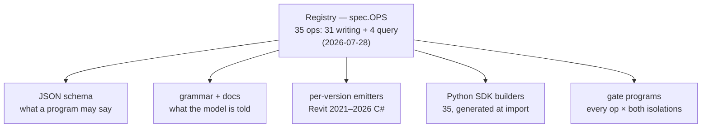
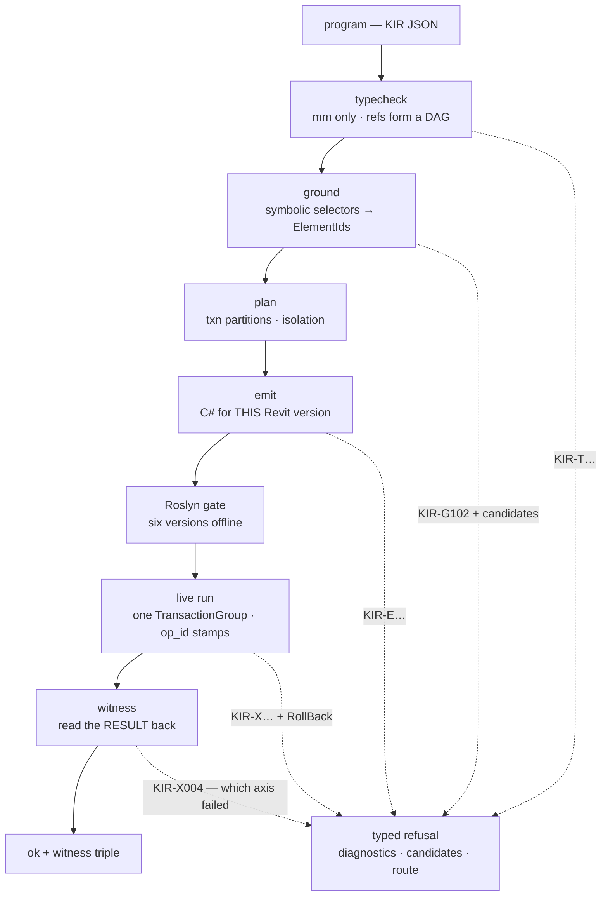
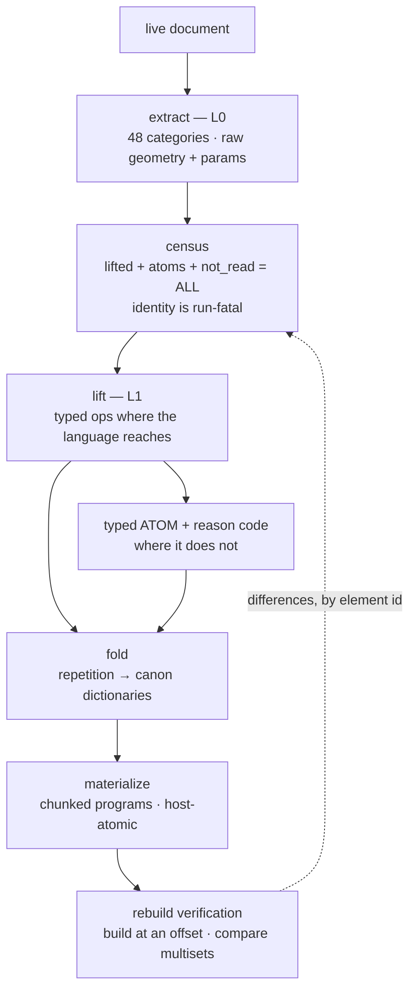

🇷🇺 [Русская версия](ARCHITECTURE.ru.md)

# KIR Architecture

> The code lands in this repository on **August 9, 2026**. This document describes the
> architecture that ships — stage by stage, with the contracts that hold it together.
> Every number here is measured and dated; the ledger of record is the
> [README's "Measured, not promised"](../README.md#measured-not-promised) table.

KIR is a typed intermediate representation for Autodesk Revit that runs in **both
directions**: forward (a program becomes a building) and reverse (a building becomes a
program). The compiler owns everything a language model is bad at — units, transactions,
API versions, hosts, rollbacks, read-back verification — so the model can spend its
capacity on geometry and composition.

---

## 1. One source of truth: the registry

Every op is declared once, in the registry (`spec.OPS`). Everything else is **generated
from that declaration** — nothing is written twice, so nothing can drift.

The consequence is a *one-source law*: when `move_elements` was added to the registry, its
SDK builder, its schema entry, its grammar line and its gate programs appeared without a
single hand-written companion. A builder signature cannot disagree with the spec, because
it is derived from the spec at import time.

The SDK adds **no semantics of its own**. It cannot express anything the registry lacks,
and it cannot hide a refusal. Python (numpy, shapely) is the brains; the registry is the
vocabulary; the compiler is the hands.

## 2. The forward pipeline

A program moves through fixed stages. Each stage can end the journey with a **typed
refusal** — a machine-readable diagnosis, never a stack trace, never a silent drop.

### 2.1 Typecheck

Units are millimetres, **only** millimetres — feet do not exist in the IR, the conversion
happens once, inside the compiler. References between ops (`{"by": "ref", "value":
"wall1"}`) must form a DAG; a door can only reference a host that exists earlier in the
program. Impossible sentences are unrepresentable rather than validated away: a door has
no free `xyz`, it has a host and an offset along it.

### 2.2 Ground

Symbolic selectors (`{"by": "name", "value": "Level 1"}`) are resolved against a snapshot
of the actual document. A selector that does not resolve — or resolves ambiguously — is a
refusal (`KIR-G102`) that carries **candidates**: the nearest names that do exist, so the
model's repair round is a lookup, not a guess. Types travel by name, never by ElementId,
which is what makes a program portable between documents.

### 2.3 Plan

The planner partitions ops into transactions and decides **isolation**:

- `atomic` — the whole program is one transaction; any postcondition violation rolls
  everything back. Nothing half-built survives.
- `per_op` — each op commits alone; one failure costs one op, and the refusal names it.

Both modes are first-class: the compile gate builds every writing program **in both
isolations** on all six Revit versions.

### 2.4 Emit

Emission produces C# for one specific Revit version — the same intent compiles differently
against 2021 and 2026, and the divergence lives in the emitters, not in the program.

Emission has its own conservation rule: **every refusal inside emitted code is rendered by
a single phrase-owner** which knows the op's identity and the program's isolation, and
renders the correct abort form for that context (roll back and return, or throw a typed
per-op refusal). A hand-written rollback anywhere else in an emitter is a build failure
(`KIR-E005`), enforced with a zero-entry allow-list. This closed a real class of bug: a
refusal that texts correctly but aborts in the wrong scope.

### 2.5 The Roslyn gate

Before anything touches a live document, every registry op is compiled as real C# against
the **actual Revit assemblies of all six versions** — offline, in CI. As of 2026-07-28
that is 101 atomic + 69 per-op programs × 6 versions = **1 056 compilations, 0 failures**.

The gate proves compilability, not behaviour — which is why it is a *gate* and not a
result. Behaviour is proven by witnesses.

### 2.6 Live run and idempotence

A program executes inside one `TransactionGroup`. Every created element is **stamped with
its op id inside the same transaction** — so a stamp cannot exist without its element or
vice versa. Retry is therefore idempotent by construction: re-running a program skips
whatever already carries a stamp, and "resume from op K" is simply "skip the stamped
prefix". The same instruction issued twice does not produce two doors.

### 2.7 Witness

After the transaction commits, the compiler **reads the result back from the document** —
the element's location curve, its parameters, its host — and signs up to three axes:
`geometry_ok`, `semantic_ok`, `topology_ok`. The witness reads the *result*, never the
*call*: an API whose return value lies (and we have measured ones that do — see
[the traps article](articles/2026-07-revit-api-traps.md)) cannot forge a witness, because
the witness goes back to the model and looks.

A violated postcondition rolls the transaction back and refuses with the axis that failed
(`KIR-X004`). The contract of the whole pipeline is that **every call ends in exactly one
of two typed outcomes**:

| outcome | carries |
|---|---|
| `ok` | witness triple, created ids, receipts |
| `refused` | typed code (`KIR-G/T/L/E/C/X/W`), diagnostics, candidates, a route to a fallback |

`ok:true` wrapping a nested error is the single forbidden state, pinned by a permanent
regression test.

## 3. The reverse pipeline

The same IR, run backwards: a live document becomes a set of KIR programs. This is what
turns "we can build" into "we can edit, diff and rebuild what already exists".

### 3.1 Extract and the census

Extraction reads the document into L0 across **48 categories** (2026-07-28). The census is
the first conservation law in action: every element in the document is accounted for as
*lifted*, *atom*, or *not read* — and the identity `lifted + atoms + not_read = whole
document` is checked at run time and is fatal when broken. Coverage percentages are
computed against the census, so a category the extractor skipped **lowers** the number
instead of silently vanishing from the denominator.

### 3.2 Lift: typed ops or typed atoms

Where the forward language reaches, geometry lifts into the same ops a human would write.
Where it does not, the element becomes a **typed atom with a reason code** — a
first-class object that names *why* (e.g. `unsupported_forward_signature` naming the exact
API entry point), not a silent drop.

The discipline matters most when it costs us. Curtain-wall mullions lifted beautifully as
956 individual placements — until a live rebuild showed that a rebuilt curtain wall
**generates its own mullions**, so ours would have landed on top of Revit's as duplicates.
The honest fix was to demote them to typed atoms, which moved facade coverage from 95.0%
*down* to 55.8% (2026-07-28). A lift that would not survive its own rebuild is not
coverage; the census now knows that.

### 3.3 Fold

Buildings repeat. Fold finds the repetition and replaces it with **canon dictionaries** —
a canonical template plus per-instance deltas — so a 90 000-element document does not
become 90 000 ops. Fidelity is part of the contract: a fold that cannot reproduce its
instances byte-for-type does not fold.

### 3.4 Materialize

Programs are materialized in chunks with hard invariants:

- **host-atomicity** — a host and the elements it carries never split across programs;
- **ordering** — rooms are placed only after every wall they depend on exists;
- **blast-radius isolation** — an element group known to be able to fail an entire
  transaction (a measured Revit behaviour, not a guess) can be materialized into its own
  single-op program, so one refusing element costs one op instead of a 250-op chunk.

### 3.5 Rebuild verification

The loop closes by *building the lifted programs back* — into the same document at a
coordinate offset, or a disposable copy — and comparing element multisets. The comparison
is performed by the census machinery, so it inherits the same honesty: skipped elements
are named, not ignored. This loop is what caught the mullion self-duplicate.

## 4. The five conservation laws (§18)

Honesty is enforced arithmetic, not culture. Each law has a mechanical check; breaking one
fails a build or a run.

| # | Law | Statement | Enforcement |
|---|---|---|---|
| 1 | **Census** | lifted + atoms + not_read = the whole document | run-fatal identity check + CI fixture |
| 2 | **Receipts** | every element cut from a result emits `element_id` + typed reason | side-stage contract: rows + failures must reconcile |
| 3 | **Witness axis** | sign only the axis you actually read | certificate lint: reader kind → legal axis |
| 4 | **Contamination** | a partial read marks everything derived from it | header round-trip test + rebuild gate on partial data |
| 5 | **Neutrality** | no device ids, install paths, or locale-only keys in the IR | CI pattern lint |

The full account, with the measured incident behind each law:
[Five Conservation Laws of Honesty](articles/2026-07-five-laws-of-honesty.md).

## 5. Versioning

One program, six Revit targets (2021–2026). The registry's emitters own the divergence:
where the API changed shape between versions, the emitter branches; the program does not
know and does not care. The Roslyn gate compiles against the six real assembly sets on
every change, which is how API drift is caught at build time instead of on a user's
machine.

## 6. What this document does not claim

The reverse direction currently lifts **16 of the writing ops** — the two directions are
not the same size, and the README's [honest gaps](../README.md#not-yet--honest-gaps)
section is the authoritative list of what is unproven. Where this document and a measured
number disagree, the number wins.
