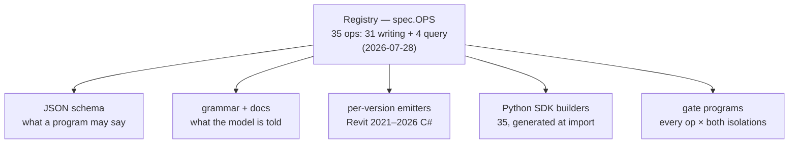
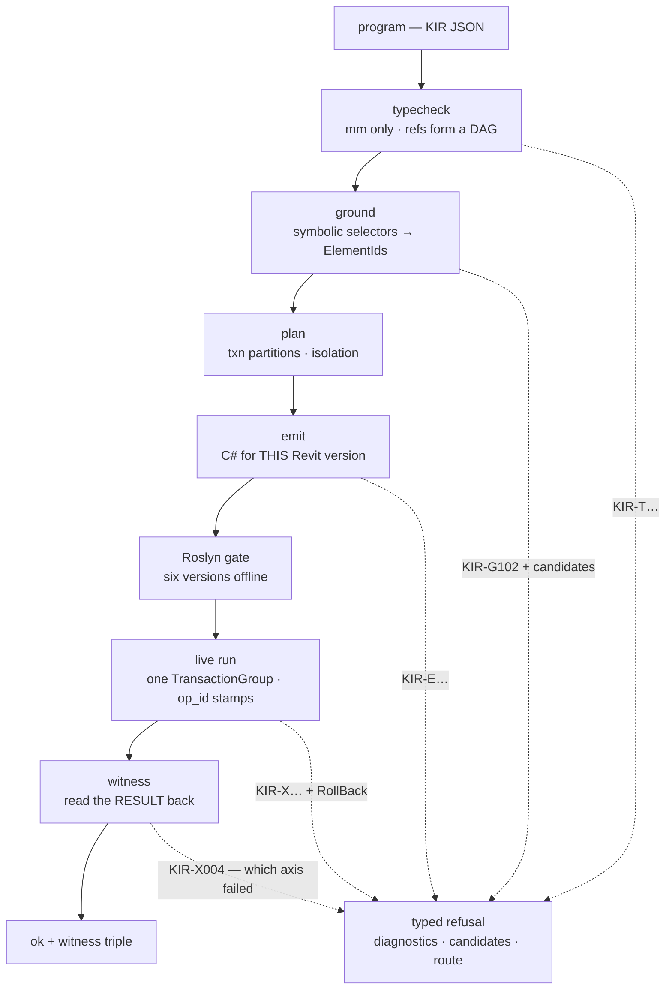
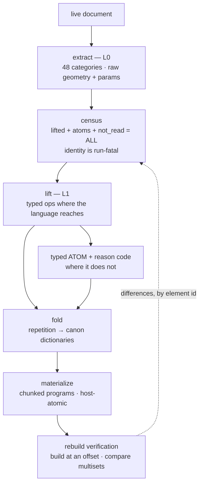

🇬🇧 [English version](ARCHITECTURE.md)

# Архитектура KIR

> Код появляется в этом репозитории **9 августа 2026**. Этот документ описывает архитектуру,
> которая идёт в поставку, — по стадиям, вместе с контрактами, которые держат её вместе.
> Каждое число здесь измерено и датировано; реестр записей — таблица
> [«Измерено, а не обещано» из README](../README.ru.md#measured-not-promised).

KIR — типизированное промежуточное представление (IR) для Autodesk Revit, которое работает **в
обе стороны**: прямое (программа становится зданием) и обратное (здание становится программой).
Компилятор берёт на себя всё, в чём языковая модель слаба, — единицы измерения, транзакции, версии
API, хосты, откаты, верификацию обратным чтением, — так что модель может тратить свои силы на
геометрию и композицию.

---

## 1. Единый источник истины: реестр

Каждый оп объявляется один раз — в реестре (`spec.OPS`). Всё остальное **генерируется из этого
объявления**: ничего не пишется дважды, а значит, ничего не может разойтись.

Отсюда следует *закон единственного источника*: когда в реестр добавили `move_elements`, следом
без единой строки, написанной вручную, появились его билдер в SDK, запись в схеме, строка в
грамматике и программы для гейта. Сигнатура билдера не может разойтись со спекой, потому что
выводится из неё же в момент импорта.

SDK не добавляет **никакой собственной семантики**. Он не может выразить ничего, чего нет в
реестре, и не может спрятать отказ. Python (numpy, shapely) — это мозги; реестр — словарь;
компилятор — руки.

## 2. Прямой конвейер

Программа проходит через фиксированные стадии. Любая из них может оборвать путь **типизированным
отказом** — машиночитаемым диагнозом, никогда не трассой стека, никогда не молчаливой потерей.

### 2.1 Проверка типов (typecheck)

Единицы измерения — миллиметры, **только** миллиметры: футов в IR не существует, перевод
происходит один раз, внутри компилятора. Ссылки между опами (`{"by": "ref", "value": "wall1"}`)
обязаны образовывать DAG: дверь может сослаться только на хост, который в программе появился
раньше неё. Невозможные предложения не отлавливаются валидацией — они просто невыразимы: у двери
нет свободного `xyz`, у неё есть хост и смещение вдоль него.

### 2.2 Заземление (ground)

Символьные селекторы (`{"by": "name", "value": "Level 1"}`) разрешаются против снимка реального
документа. Селектор, который не разрешился — или разрешился неоднозначно, — это отказ (`KIR-G102`)
с приложенными **кандидатами**: ближайшими именами, которые действительно существуют, так что
раунд починки для модели превращается в поиск по списку, а не в угадывание. Типы адресуются по
имени, никогда по ElementId, — именно это делает программу переносимой между документами.

### 2.3 План (plan)

Планировщик разбивает опы на транзакции и решает вопрос **изоляции**:

- `atomic` — вся программа — одна транзакция; любое нарушение постусловия откатывает всё целиком.
  Недостроенное не выживает.
- `per_op` — каждый оп коммитится сам по себе; один отказ стоит одного опа, и отказ называет его по
  имени.

Оба режима — полноправные: компиляционный гейт собирает каждую пишущую программу **в обеих
изоляциях** на всех шести версиях Revit.

### 2.4 Эмиссия (emit)

Эмиссия производит C# для одной конкретной версии Revit — один и тот же замысел компилируется
по-разному для 2021 и 2026, и это расхождение живёт в эмиттерах, а не в программе.

У эмиссии есть собственный закон сохранения: **каждый отказ внутри сгенерированного кода
рендерится единственным владельцем фразы**, который знает идентичность опа и изоляцию программы и
выбирает правильную форму аварийного завершения для этого контекста (откат с возвратом или типовой
per-op-throw). Отказ, написанный вручную где-либо ещё в эмиттере, — это отказ сборки (`KIR-E005`),
принудительно проверяемый allow-list'ом с нулём записей. Это закрыло целый класс реальных багов:
отказ, который текстово корректен, но прерывается не в том scope.

### 2.5 Гейт Roslyn

Прежде чем что-либо коснётся живого документа, каждый оп реестра компилируется как настоящий C#
против **реальных сборок Revit всех шести версий** — офлайн, в CI. На 2026-07-28 это
101 атомарная + 69 per-op программ × 6 версий = **1 056 компиляций, 0 отказов**.

Гейт доказывает компилируемость, а не поведение — именно поэтому это *гейт*, а не результат.
Поведение доказывают свидетели.

### 2.6 Живой запуск и идемпотентность

Программа выполняется внутри одного `TransactionGroup`. Каждый созданный элемент **штампуется
своим id опа внутри той же транзакции** — так что штамп не может существовать без своего элемента,
и наоборот. Поэтому повтор идемпотентен по конструкции: повторный запуск программы пропускает всё,
что уже несёт штамп, а «возобновить с опа K» — это просто «пропустить проштампованный префикс».
Одна и та же инструкция, поданная дважды, не порождает две двери.

### 2.7 Свидетель (witness)

После коммита транзакции компилятор **читает результат обратно из документа** — кривую
расположения элемента, его параметры, его хост — и подписывает до трёх осей: `geometry_ok`,
`semantic_ok`, `topology_ok`. Свидетель читает *результат*, никогда *вызов*: API, чьё возвращаемое
значение лжёт (а такие мы измеряли — см. [статью о ловушках](articles/2026-07-revit-api-traps.ru.md)),
не может подделать свидетельство, потому что свидетель возвращается к модели и смотрит сам.

Нарушенное постусловие откатывает транзакцию и отказывает с указанием оси, которая не выполнилась
(`KIR-X004`). Контракт всего конвейера в том, что **каждый вызов заканчивается ровно одним из двух
типизированных исходов**:

| исход | несёт |
|---|---|
| `ok` | тройку свидетеля, созданные id, квитанции |
| `refused` | типизированный код (`KIR-G/T/L/E/C/X/W`), диагностику, кандидатов, маршрут к запасному пути |

`ok:true`, оборачивающий вложенную ошибку, — единственное запрещённое состояние, закреплённое
постоянным регрессионным тестом.

## 3. Обратный конвейер

Тот же IR, только назад: живой документ становится набором программ KIR. Именно это превращает
«мы умеем строить» в «мы умеем редактировать, сравнивать diff'ом и пересобирать то, что уже
существует».

### 3.1 Извлечение и перепись

Извлечение читает документ в L0 по **48 категориям** (2026-07-28). Перепись — это первый закон
сохранения в действии: каждый элемент документа учитывается либо как *лифтованный*, либо как
*атом*, либо как *непрочитанный* — и тождество «лифтованные + атомы + непрочитанные = весь
документ» проверяется во время выполнения и фатально при нарушении. Проценты покрытия считаются
против переписи, так что категория, которую экстрактор пропустил, **понижает** число, а не тихо
исчезает из знаменателя.

### 3.2 Лифт: типизированные опы или типизированные атомы

Там, где прямой язык дотягивается, геометрия лифтуется в те же опы, что написал бы человек. Там,
где не дотягивается, элемент становится **типизированным атомом с кодом причины** — полноценным
объектом, который называет *почему* (например, `unsupported_forward_signature` с точным именем
точки входа API), а не молча теряется.

Эта дисциплина важнее всего именно тогда, когда она нам дорого обходится. Импосты витража
лифтовались прекрасно — 956 отдельных размещений, — пока живая пересборка не показала, что
пересобранный витраж **генерирует собственные импосты сам**, и наши легли бы поверх них дубликатами.
Честным решением стало разжаловать их в типизированные атомы, что сдвинуло покрытие фасада с 95.0%
*вниз* до 55.8% (2026-07-28). Лифт, который не переживёт собственную пересборку, — это не покрытие;
теперь перепись это знает.

### 3.3 Фолд

Здания повторяются. Фолд находит повторение и заменяет его **канон-словарями** — каноническим
шаблоном плюс дельтами по каждому экземпляру, — так что документ из 90 000 элементов не
превращается в 90 000 опов. Точность воспроизведения — часть контракта: фолд, который не может
восстановить свои экземпляры байт-в-тип, не считается фолдом.

### 3.4 Материализация

Программы материализуются чанками с жёсткими инвариантами:

- **атомарность по хосту** — хост и элементы, которые он несёт, никогда не разъезжаются по разным
  программам;
- **порядок** — комнаты размещаются только после того, как существуют все стены, от которых они
  зависят;
- **изоляция радиуса поражения** — группа элементов, про которую измерено, что она способна
  завалить всю транзакцию целиком (это измеренное поведение Revit, а не догадка), может
  материализоваться в собственную однооповую программу, так что один отказавший элемент стоит один
  оп, а не чанк из 250 опов.

### 3.5 Проверка пересборкой

Цикл замыкается тем, что *лифтованные программы собираются заново* — в тот же документ со сдвигом
координат либо в одноразовую копию — и сравниваются множества элементов. Сравнение выполняет та же
машинерия переписи, так что оно наследует ту же честность: пропущенные элементы называются
по имени, а не игнорируются. Именно этот цикл поймал самодублирование импостов.

## 4. Пять законов сохранения (§18)

Честность — это принудительная арифметика, а не культура. У каждого закона есть механическая
проверка; нарушение роняет сборку или прогон.

| # | Закон | Формулировка | Механизм принуждения |
|---|---|---|---|
| 1 | **Перепись** | лифтованные + атомы + непрочитанные = весь документ | фатальная во время выполнения проверка тождества + фикстура CI |
| 2 | **Квитанции** | каждый элемент, вырезанный из результата, порождает `element_id` + типизированную причину | контракт побочной стадии: строки и отказы должны сходиться |
| 3 | **Ось свидетеля** | подписывай только ту ось, которую действительно прочитал | линт сертификата: вид читателя → законная ось |
| 4 | **Заражение** | частичное чтение помечает всё, что из него выведено | round-trip-тест заголовка + гейт пересборки на частичных данных |
| 5 | **Нейтральность** | никаких id устройств, путей установки или ключей только на локали в IR | линт паттернов в CI |

Полный разбор с измеренным инцидентом за каждым законом:
[Пять законов сохранения честности](articles/2026-07-five-laws-of-honesty.ru.md).

## 5. Версионирование

Одна программа, шесть целей Revit (2021–2026). Расхождение принадлежит эмиттерам реестра: там, где
API между версиями поменял форму, ветвится эмиттер — программа об этом не знает и знать не должна.
Гейт Roslyn компилирует против шести реальных наборов сборок при каждом изменении, и именно так
дрейф API ловится во время сборки, а не на машине пользователя.

## 6. Чего этот документ не утверждает

Обратное направление сегодня лифтует **16 из пишущих опов** — два направления не равны по размеру,
и раздел README про [честные пробелы](../README.ru.md#not-yet--honest-gaps) — авторитетный список
того, что не доказано. Там, где этот документ расходится с измеренным числом, побеждает число.
